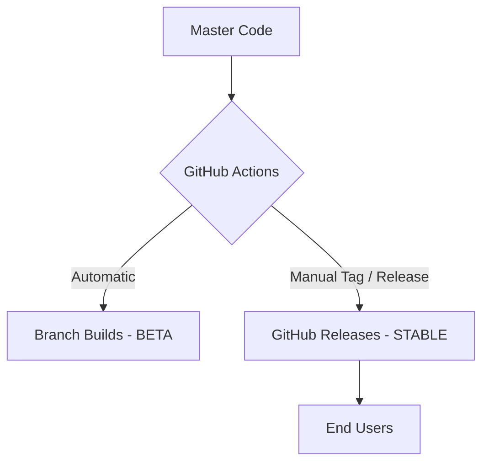

<div align="center">


# 🌊 Open Cloudstream Extensions (OCE)
### *Redefining Resilience. Empowering Discovery. Bridging Content.*

[](https://github.com/byimam2nd/oce/actions)

[](https://cloudstream.cf)
[](https://www.gnu.org/licenses/gpl-3.0)
[](https://github.com/byimam2nd/oce)
[](https://github.com/byimam2nd/oce/graphs/commit-activity)

<p align="center">
  <b>OCE adalah jembatan digital yang menghubungkan Anda dengan hiburan tanpa batas melalui ekosistem yang stabil, modular, dan transparan.</b>
  <br><br>
  <a href="#-filosofi-kami">Filosofi</a> •
  <a href="#-fitur-utama">Fitur Utama</a> •
  <a href="#-instruksi-instalasi">Instalasi</a> •
  <a href="#-ekosistem-teknis">Teknologi</a> •
  <a href="#-kontribusi">Kontribusi</a>
</p>

---

</div>

## 📖 Filosofi Kami

Dunia hiburan digital berkembang begitu cepat, namun stabilitas seringkali terabaikan. **OCE** (Open Cloudstream Extensions) lahir dari visi untuk menciptakan standar baru dalam penyediaan konten pihak ketiga. Kami tidak hanya membuat kode; kami membangun **ketahanan**.

Kami percaya bahwa akses terhadap informasi dan hiburan haruslah:
1.  **Resilien:** Tetap teguh meskipun struktur sumber berubah.
2.  **Modular:** Logika yang terisolasi untuk skalabilitas tanpa batas.
3.  **Humanis:** Dirancang untuk kemudahan manusia, bukan sekadar mesin.

---

## ✨ Fitur & Keunggulan Utama

Mengapa OCE menjadi pilihan utama bagi ribuan pengguna CloudStream?

### **🚀 Performa Tanpa Kompromi**
Setiap baris kode dioptimalkan untuk mengurangi latensi. Kami meminimalkan request yang tidak perlu untuk memastikan pemuatan data secepat kilat.

### **🧩 Arsitektur Modular (Clean Code)**
Logika scraping, transformasi data, dan adapter Cloudstream dipisahkan secara ketat. Ini memudahkan pengembangan fitur baru tanpa risiko regresi pada modul lain.

### **🛡️ Sistem Audit "Nuclear"**
Sistem kami melakukan audit otomatis harian untuk mendeteksi perubahan sekecil apa pun pada website sumber. Kami memperbaiki masalah bahkan sebelum Anda menyadarinya.

### **🇮🇩 Fokus pada Kedekatan**
Kami memahami komunitas Indonesia. Itulah mengapa kami mengkurasi sumber-sumber terbaik dengan dukungan bahasa lokal yang kaya dan akurat.

---

## 📥 Instruksi Instalasi

Hanya perlu tiga langkah sederhana untuk membuka pintu menuju dunia hiburan baru.

### **Pemasangan Repository (Otomatis)**
Sangat disarankan untuk mendapatkan rilis stabil terbaru secara otomatis.

1.  **Salin Tautan Resmi (Stable):**
    ```text
    https://github.com/byimam2nd/oce/raw/master/repo.json
    ```

2.  **Salin Tautan Pengujian (Beta/Testing):**
    ```text
    https://github.com/byimam2nd/oce/raw/master/repo-beta.json
    ```

3.  Buka **CloudStream** ➡️ **Settings** ➡️ **Extensions**.
4.  Pilih **Add Repository**, beri nama `OCE`, dan tempelkan salah satu tautan di atas.

---

## ⚙️ Ekosistem Teknis & Otomatisasi

Dibalik tampilan yang sederhana, OCE ditenagai oleh mesin yang sangat terorganisir dengan **Arsitektur Modular V2.2.0**.

### **1. Modular Component Map**
- **Scrapper:** Mengelola alur koneksi dan orkestrasi scraping.
- **Mapper:** Mengubah elemen HTML mentah menjadi data terstruktur.
- **Cloudstream Adapter:** Jembatan murni antara mesin internal dan aplikasi.
- **HTML Constants:** Pusat kontrol selector berbasis *Owner Tagging*.

### **2. Dual-Workflow Distribution**


---

## 🎖️ Credits & Penghargaan Spesial

Hormat kami kepada:
- **[CloudStream Team & Community](https://github.com/recloudstream)**
- **[Phisher](https://github.com/Phisher98)**
- **[ExtCloud](https://github.com/recloudstream/cloudstream-extensions)**

---

## 🤝 Bergabung & Berkontribusi

Kami selalu terbuka untuk pikiran-pikiran cerdas. Anda dapat berkontribusi melalui [Issues](https://github.com/byimam2nd/oce/issues) atau memberikan **Star ⭐** jika OCE membantu hari-hari Anda.

**Ingin mendukung operasional kami?**
- ☕ [Buy Me A Coffee](https://buymeacoffee.com/imam2nd)
- 💖 [SociaBuzz (Dukungan Lokal)](https://sociabuzz.com/imam2nd/tribe)

---

## ⚖️ Lisensi & Tanggung Jawab

Proyek ini dilindungi oleh lisensi **GNU GPLv3**. Penggunaan alat ini sepenuhnya merupakan tanggung jawab pengguna. Harap gunakan dengan bijak dan hargai karya para kreator asli.

---
<div align="center">
  <b>Managed with passion and precision by <a href="https://github.com/byimam2nd">imam2nd</a></b>
  <br>
  <i>"For the community, by the community."</i>
</div>
