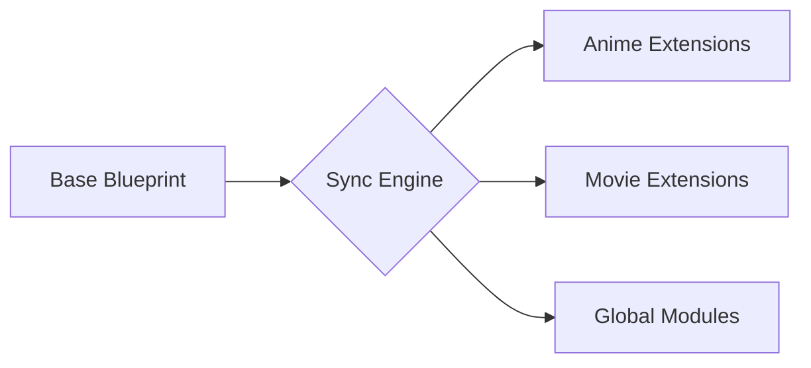

<div align="center">


# 🌊 Open Cloudstream Extensions (OCE)
### *Redefining Resilience. Empowering Discovery. Bridging Content.*

[](https://github.com/byimam2nd/oce/actions)
[](https://cloudstream.cf)
[](https://www.gnu.org/licenses/gpl-3.0)
[](https://github.com/byimam2nd/oce)
[](https://github.com/byimam2nd/oce/graphs/commit-activity)

<p align="center">
  <b>OCE adalah jembatan digital yang menghubungkan Anda dengan hiburan tanpa batas melalui ekosistem yang stabil, cerdas, dan transparan.</b>
  <br><br>
  <a href="#-filosofi-kami">Filosofi</a> •
  <a href="#-fitur-utama">Fitur Utama</a> •
  <a href="#-instruksi-instalasi">Instalasi</a> •
  <a href="#-ekosistem-teknis">Teknologi</a> •
  <a href="#-kontribusi">Kontribusi</a>
</p>

---

</div>

## 📖 Filosofi Kami

Dunia hiburan digital berkembang begitu cepat, namun stabilitas seringkali terabaikan. **OCE** (Open Cloudstream Extensions) lahir dari visi untuk menciptakan standar baru dalam penyediaan konten pihak ketiga. Kami tidak hanya membuat kode; kami membangun **ketahanan**.

Kami percaya bahwa akses terhadap informasi dan hiburan haruslah:
1.  **Resilien:** Tetap teguh meskipun struktur sumber berubah.
2.  **Transparan:** Membangun di atas pondasi open-source yang jujur.
3.  **Humanis:** Dirancang untuk kemudahan manusia, bukan sekadar mesin.

---

## ✨ Fitur & Keunggulan Utama

Mengapa OCE menjadi pilihan utama bagi ribuan pengguna CloudStream?

### **🚀 Performa Tanpa Kompromi**
Setiap baris kode dioptimalkan untuk mengurangi latensi. Kami meminimalkan request yang tidak perlu untuk memastikan pemuatan data secepat kilat.

### **🛡️ Sistem Audit "Nuclear"**
Keamanan dan stabilitas adalah prioritas. Sistem kami melakukan audit otomatis harian untuk mendeteksi perubahan sekecil apa pun pada website sumber. Kami memperbaiki masalah bahkan sebelum Anda menyadarinya.

### **🇮🇩 Fokus pada Kedekatan**
Kami memahami komunitas Indonesia. Itulah mengapa kami mengkurasi sumber-sumber terbaik dengan dukungan bahasa lokal yang kaya dan akurat.

### **💎 Arsitektur Berbasis Blueprint**
Menggunakan sistem sinkronisasi terpusat, setiap peningkatan fitur pada satu ekstensi akan secara otomatis diterapkan ke seluruh ekosistem OCE. Konsistensi adalah kunci kualitas kami.

---

## 📥 Instruksi Instalasi

Hanya perlu tiga langkah sederhana untuk membuka pintu menuju dunia hiburan baru.

### **Pemasangan Repository (Otomatis)**
Sangat disarankan untuk mendapatkan perbaikan bug dan fitur baru secara *real-time*.

1.  **Salin Tautan Resmi:**
    ```text
    https://raw.githubusercontent.com/byimam2nd/oce/builds/plugins.json
    ```
2.  Buka **CloudStream** ➡️ **Settings** ➡️ **Extensions**.
3.  Pilih **Add Repository**, beri nama `OCE`, dan tempelkan tautan di atas.

---

## ⚙️ Ekosistem Teknis & Otomatisasi

Dibalik tampilan yang sederhana, OCE ditenagai oleh mesin yang sangat terorganisir. Kami memisahkan logika utama (Blueprint) dari implementasi akhir untuk efisiensi maksimal.

### **1. Sync Engine Architecture**
Sistem sinkronisasi kami memastikan bahwa peningkatan kualitas pada satu modul akan berdampak pada seluruh modul lainnya tanpa adanya redundansi kode.

*(Diagram konseptual alur distribusi kode kami)*

### **2. Quality Assurance Pipeline**
Setiap commit melalui proses validasi ketat menggunakan skrip audit selektor yang canggih. Jika audit gagal, build tidak akan dikirimkan ke pengguna. Inilah janji kami untuk stabilitas.

---

## 🎖️ Credits & Penghargaan Spesial

Proyek ini adalah hasil kolaborasi dan inspirasi dari para pionir di bidangnya. Hormat kami kepada:

- **[CloudStream Team & Community](https://github.com/recloudstream)** - Pencipta ekosistem yang luar biasa ini.
- **[Phisher](https://github.com/Phisher98)** - Mentor arsitektural yang memberikan standar logika penyedia konten yang solid.
- **[ExtCloud](https://github.com/recloudstream/cloudstream-extensions)** - Referensi profesional dalam pengembangan ekstensi modern.

---

## 📈 Perkembangan Proyek (Star History)

Dukungan Anda melalui **Star** bukan sekadar angka bagi kami; itu adalah bahan bakar yang memotivasi kami untuk terus berinovasi dan menjaga resiliensi ekosistem ini.

<picture>
  <source media="(prefers-color-scheme: dark)" srcset="https://api.star-history.com/svg?repos=byimam2nd/oce&type=Date&theme=dark" />
  <source media="(prefers-color-scheme: light)" srcset="https://api.star-history.com/svg?repos=byimam2nd/oce&type=Date" />
  
</picture>

---

## 🤝 Bergabung & Berkontribusi

Kami selalu terbuka untuk pikiran-pikiran cerdas. Anda dapat berkontribusi melalui:
- **Pelaporan Bug:** Beritahu kami jika ada sesuatu yang tidak bekerja melalui [Issues](https://github.com/byimam2nd/oce/issues).
- **Diskusi:** Bagikan ide Anda untuk pengembangan fitur masa depan.
- **Dukungan Moral:** Berikan **Star ⭐** pada repository ini jika OCE membantu hari-hari Anda.

**Ingin mendukung operasional kami?**
- ☕ [Buy Me A Coffee](https://buymeacoffee.com/imam2nd)
- 💖 [SociaBuzz (Dukungan Lokal)](https://sociabuzz.com/imam2nd/tribe)

---

## ⚖️ Lisensi & Tanggung Jawab

Proyek ini dilindungi oleh lisensi **GNU GPLv3**. 

**Disclaimer Penting:** OCE adalah proyek independen. Kami tidak menyimpan, mengunggah, atau memiliki file video apa pun. Kami menyediakan alat pencarian cerdas untuk mengakses konten publik yang tersedia di internet. Penggunaan alat ini sepenuhnya merupakan tanggung jawab pengguna. Harap gunakan dengan bijak dan hargai karya para kreator asli.

---
<div align="center">
  <b>Managed with passion and precision by <a href="https://github.com/byimam2nd">imam2nd</a></b>
  <br>
  <i>"For the community, by the community."</i>
</div>
